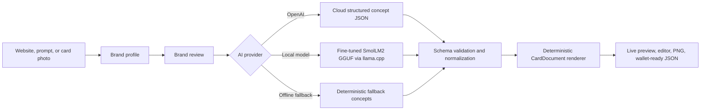

# Romax Pass AI

Romax Pass AI is an open-source membership card generator that turns a website,
prompt, or physical card photo into branded digital membership card concepts.

The app extracts or creates a brand profile, uses AI to choose card-design
intent, renders the final card with a deterministic React scene graph, and
exports wallet-ready JSON plus a PNG preview.

## What It Does

- Scrapes a website for brand name, colors, logo candidates, hero images,
  profile images, industry, and tone.
- Supports no-website flows using a prompt, reference image, physical membership
  card, or visiting card.
- Lets the user review and correct the locked brand profile before design
  generation.
- Generates card concepts through either OpenAI or a local fine-tuned edge
  model.
- Keeps AI away from React rendering. The model returns structured design
  intent; the app renders safe card documents.
- Lets users select member fields, upload photo/art, edit card nodes, remove
  decorative image layers, and export a PNG.
- Produces wallet-ready JSON for future Apple Wallet / Google Wallet flows.

## Architecture



## Repository Contents

| Path | Purpose |
|---|---|
| `app/`, `components/`, `lib/`, `types/` | Next.js app and renderer |
| `training/` | Local model training, evaluation, and dataset generation |
| `training/data/` | Synthetic training, validation, and test data |
| `config/local-concept.schema.json` | JSON Schema for local model output |
| `MODEL_CARD.md` | Fine-tuned local model documentation |
| `DATASET_CARD.md` | Synthetic dataset documentation |
| `docs/model-comparison.md` | GPT-5.4 mini vs local model report |
| `docs/huggingface-release.md` | Hugging Face model upload instructions |
| `infra/pi/` | Raspberry Pi / constrained local model simulation |
| `huggingface/` | Model-card template for the Hugging Face model repo |

## Model Weights

Model weights are **not committed to normal Git**.

The repository includes:

- model details
- training scripts
- synthetic datasets
- evaluation summary
- Hugging Face model-card template
- upload preparation script

Host the actual GGUF weight in a Hugging Face model repository. Recommended
target:

```text
aayushale001/romax-card-designer-local
```

Prepare the Hugging Face upload folder:

```bash
npm run model:prepare-hf
```

If the model is not at `infra/pi/models/card-designer.gguf`, provide it:

```bash
MODEL_GGUF=/path/to/card-designer-q4_k_m.gguf npm run model:prepare-hf
```

The generated folder is ignored by Git:

```text
dist/huggingface-model/
```

See [docs/huggingface-release.md](docs/huggingface-release.md) for upload
commands.

## Local Setup

```bash
npm install
cp .env.example .env.local
npm run dev
```

Open:

```text
http://localhost:3000
```

## AI Providers

### OpenAI

Set:

```env
AI_PROVIDER=openai
OPENAI_API_KEY=...
OPENAI_MODEL=gpt-4.1-mini
OPENAI_VISION_MODEL=gpt-4.1-mini
```

### Local Model

Start an OpenAI-compatible local server:

```bash
llama-server \
  -m infra/pi/models/card-designer.gguf \
  --alias card-designer-local \
  --host 127.0.0.1 \
  --port 8080 \
  -c 512 \
  -t 4 \
  -np 1
```

Set:

```env
AI_PROVIDER=local
LOCAL_LLM_BASE_URL=http://127.0.0.1:8080/v1
LOCAL_LLM_MODEL=card-designer-local
LOCAL_LLM_CONCEPT_COUNT=4
LOCAL_LLM_MAX_TOKENS=430
```

Smoke test:

```bash
npm run local-ai:smoke
```

## Training

Generate datasets:

```bash
npm run training:data:v4
npm run training:data:scenario-v5
npm run training:data:v6
```

Train V6:

```bash
python3.11 -m venv .venv
source .venv/bin/activate
pip install -r training/requirements.txt
npm run training:train:v6
```

Export GGUF:

```bash
PYTHON_BIN=.venv/bin/python bash training/export_gguf.sh
```

More details:

- [training/README.md](training/README.md)
- [MODEL_CARD.md](MODEL_CARD.md)
- [DATASET_CARD.md](DATASET_CARD.md)

## Verification

```bash
npm run lint
npm run build
```

## Open Source License

The application source, documentation, and synthetic datasets in this repository
are released under the [MIT License](LICENSE), unless a file explicitly states
otherwise.

The fine-tuned model weights should be published separately on Hugging Face
under Apache-2.0, matching the base model license.
